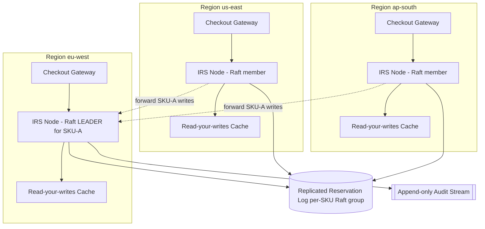

# ADR-0007: Consistency Model & Failure Handling for the Inventory Reservation Service (IRS)

- Status: Accepted
- Date: 2026-07-19
- Deciders: Platform Architecture Guild
- Scope: Reservation lifecycle only (reserve / confirm / release). Payments, catalog, pricing, and fulfillment are out of scope.
- Supersedes: the per-region asynchronous inventory cache (ADR-0003).

## Context

Northstar Commerce runs limited-quantity flash sales across three regions (`us-east`, `eu-west`, `ap-south`). Shoppers hit their nearest region for latency. Under the current design each region keeps a local inventory cache and reconciles asynchronously, so two regions can both believe the last unit of a SKU is available and both confirm an order. The result is **oversell**: `confirmed + held > physical_stock`, forcing manual cancellations and refunds.

The forces in tension:

- **Correctness under contention.** Thousands of shoppers race for the same scarce SKU within seconds. The last-unit decision is inherently a consensus problem.
- **Latency.** Shoppers expect a fast local `reserve`.
- **Partitions happen.** Inter-region links fail. We must decide, per the CAP trade-off, what we give up during a partition.
- **Retries are pervasive.** Mobile clients and API gateways retry aggressively during drops.

Assumptions: SKU stock counts are authoritative and change only through the IRS during a drop; a drop involves a bounded set of "hot" SKUs (hundreds, not millions); clock skew between regions is bounded by NTP to a few hundred ms and is **not** relied upon for correctness.

## Requirements

We decompose the given requirements into functional and non-functional groups and record how each constrains the design.

**Functional**

- F1 (from R1): The system MUST never allow `confirmed + active_held > physical_stock` for any SKU. This is the primary correctness requirement and drives the whole decision.
- F2 (from R4): `reserve` and `confirm` MUST be idempotent under retry via a client-supplied idempotency key.
- F3 (from R5): Holds MUST expire after their TTL and their units MUST be automatically reclaimed to available stock.
- F4 (from R6): Every reservation state transition SHOULD be recorded in an append-only audit log.

**Non-functional**

- N1 (from R2): p99 `reserve` latency SHOULD be < 150 ms for a shopper served by their local region under normal (non-partitioned) operation.
- N2 (from R3): Under an inter-region partition, the system MUST preserve F1 (correctness) and MAY sacrifice write availability for SKUs whose authority is on the far side of the partition; local reads MAY be served stale.

The binding constraint is F1 combined with N2: correctness is non-negotiable even under partition, which means the last-unit decision cannot be made independently in two regions. That single observation determines the consistency model below.

## Decision

**We choose a linearizable (strongly consistent) write path for reservation state, scoped per SKU via single-leader ownership (partitioned/sharded consensus).** Reads on the checkout hot path MAY be served from a local read-your-writes cache; only the authoritative `reserve` / `confirm` mutation is linearized.

Rationale, tied to requirements:

- F1 requires a single global decision point for "is the last unit still available?". Only a linearizable register for each SKU's `available` counter makes the decrement a total order, so a compare-and-decrement can atomically reject the request that would breach stock. Causal or eventual consistency permits two concurrent decrements to both succeed and reconcile later — exactly the oversell we are eliminating.
- We avoid the latency cost of *global* linearizability by **sharding leadership per SKU**. Each SKU is owned by a Raft group whose leader lives in one region. Reservation writes for that SKU are routed to its leader, so most traffic still commits within one region-local consensus round; cross-region cost is paid only for SKUs whose leader is remote. This keeps N1 achievable for the common case while never weakening F1.
- Under partition (N2), a SKU whose leader is unreachable becomes **read-only / write-unavailable** for the isolated regions: we deliberately choose CP over AP for the reservation write path. Correctness is preserved; the degradation is a `reserve` returning `503 leader_unavailable` for far-side SKUs, which the client surfaces as "try again".

Component view:



Expiry and reclaim are handled by a leader-local sweeper: the SKU leader owns a min-heap of hold deadlines and, because it is the linearization point, it can safely apply an `EXPIRE` entry that increments `available` without any cross-region coordination.

## API Contract

All mutating endpoints are idempotent via a client-supplied `Idempotency-Key` header. The IRS MUST persist the `(idempotency_key -> outcome)` mapping in the same Raft log as the state change, so a retry replays the recorded outcome instead of applying a second effect.

### `POST /skus/{sku}/reservations` (reserve)

Request:

```json
{ "qty": 1, "customer_id": "c_123", "ttl_seconds": 600 }
```

Headers: `Idempotency-Key: <uuid>` (REQUIRED).

- On success the IRS MUST atomically check `available >= qty`, decrement `available`, increment `held`, and return `201` with `{ "reservation_id", "state": "HELD", "expires_at" }`.
- If `available < qty` it MUST return `409 insufficient_stock` and MUST NOT change any counter.
- A retry carrying a previously seen `Idempotency-Key` MUST return the original response (same `reservation_id`) and MUST NOT create a second hold.
- If the SKU leader is unreachable from the serving node it MUST return `503 leader_unavailable`; clients SHOULD retry with backoff.

### `POST /reservations/{id}/confirm` (confirm)

- MUST transition `HELD -> CONFIRMED`, moving units from `held` to `confirmed` with no change to `available`.
- MUST be idempotent: confirming an already-`CONFIRMED` reservation MUST return `200` with the same body, not an error.
- Confirming a reservation that has already expired MUST return `410 reservation_expired`.

### `POST /reservations/{id}/release` (release / cancel)

- MUST transition `HELD -> RELEASED`, incrementing `available` by the held qty.
- MUST be idempotent and safe to call after expiry (returns `200`, no double credit).
- MAY be called by the client (explicit abandon) or internally by the expiry sweeper.

Error model (all endpoints): responses use `{ "error": <code>, "message": <human text> }` with the HTTP status codes above; `4xx` errors are terminal, `503` is retryable.

## Failure Matrix

| Failure mode | Effect if unhandled | Detection | Handling strategy |
| --- | --- | --- | --- |
| Inter-region network partition | Isolated region can't reach a remote SKU leader; naive design would let it decide locally and oversell | Raft heartbeat loss / forward RPC timeout | Choose CP: far-side SKUs become write-unavailable in the isolated region; `reserve` returns `503 leader_unavailable`; local reads MAY be served stale-but-labeled. F1 preserved. |
| Loss of primary/leader for a SKU | No node can commit reservations for that SKU; drop stalls | Raft election timeout | Raft automatically elects a new leader from the in-sync followers; in-flight uncommitted writes are retried by the gateway under the same idempotency key, so no double effect. |
| Duplicate client retry | Same `reserve`/`confirm` applied twice -> double hold or double decrement | Idempotency-Key already present in the committed log | Replay the recorded outcome; the second application is a no-op. Guarantees F2/R4. |
| Reservation-expiry timeout | Abandoned holds pin stock forever; SKU appears sold out while units are free | Leader-local deadline heap fires at `expires_at` | Leader applies an `EXPIRE` log entry that moves units from `held` back to `available`; idempotent vs. a concurrent client `release`. Satisfies F3/R5. |
| Cache serving stale `available` | Shopper sees stock that is gone; `reserve` still safe because leader re-checks | Version/lease staleness on read | Reads are advisory only; the authoritative decrement on the leader is the sole gate, so staleness costs a retry, never correctness. |

## Invariants

These are monitored continuously; a violation MUST page on-call and halt the affected SKU's write path.

- **INV-1 (No oversell, from R1).** For every SKU at every committed log index, `confirmed + held + available == physical_stock`, and therefore `confirmed + held <= physical_stock` MUST hold. No committed reservation may push `available` below zero.
- **INV-2 (Single linearization point).** For any SKU, all `reserve`/`confirm`/`release`/`EXPIRE` entries MUST be totally ordered in exactly one Raft log; there MUST NOT exist two entries for the same SKU committed by two different leader terms at the same index.
- **INV-3 (Idempotent effect).** For any `Idempotency-Key`, the committed log MUST contain at most one state-changing entry; all retries MUST map to that single entry's recorded outcome.
- **INV-4 (Conservation under expiry).** An `EXPIRE` or `release` entry MUST increment `available` by exactly the qty previously moved to `held`, so units are neither created nor destroyed.

## Trade-offs

What this decision **sacrifices**:

- **Write availability under partition.** By choosing CP, a partitioned region cannot reserve far-side SKUs at all. We accept lost sales during a partition in exchange for never overselling. This is the correct business call: an oversell is more expensive (refund + reputation) than a shopper being asked to retry.
- **Tail latency for cross-region SKUs.** A `reserve` for a SKU whose leader is in another region pays one cross-region consensus round-trip, which can exceed the 150 ms N1 target. We bound the blast radius by pinning each hot SKU's leader to the region expected to receive the most traffic for that drop, so the *majority* of requests stay region-local.

Rejected alternatives:

- **Eventual consistency + async reconciliation (status quo).** Rejected: it is exactly what causes oversell today; reconciliation after the fact cannot un-sell a physical unit.
- **Globally linearizable single-region datastore.** Rejected: it satisfies F1 trivially but forces every region's `reserve` through one region, blowing the N1 latency budget for two of three regions even in the healthy case.
- **CRDT-based counters (PN-Counter).** Rejected: CRDTs converge but permit transient negative-looking states; there is no CRDT that enforces a hard non-negative bound without external coordination, so they cannot guarantee INV-1.

## Consequences

Positive:

- Oversell is eliminated by construction (INV-1), removing the manual cancellation/refund workload.
- Retry storms during drops become safe (INV-3), so gateways can retry freely.
- Per-SKU sharded leadership keeps common-case latency region-local, meeting N1 for most traffic.

Negative / operational:

- We take on the operational cost of running per-SKU Raft groups, leader placement, and rebalancing before a drop.
- Partitions produce visible `503`s to shoppers for far-side SKUs; product and support MUST have messaging for "temporarily unavailable, retry".
- Leader placement becomes a pre-drop planning step (which region should own each hot SKU).

Follow-up work:

- Automate pre-drop leader placement from forecasted regional demand.
- Add a load-shedding admission gate so a sold-out SKU short-circuits to `409` before hitting consensus.
- Wire INV-1..INV-4 into the continuous verification monitor and the audit stream (F4).